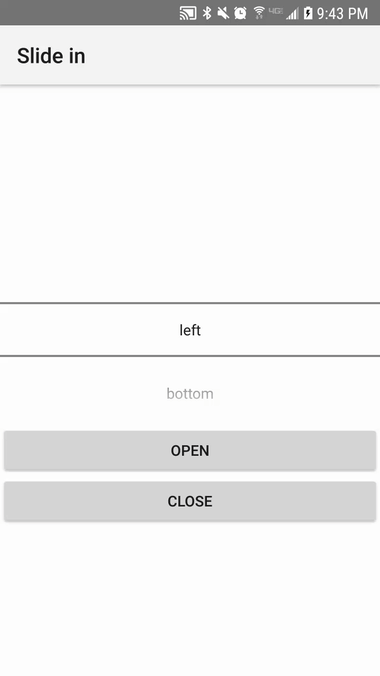

# NativeScript-Angular-SlideIn
An Angular directive for NativeScript to position views off the screen and animate them in and out.

## Platforms
 - Works on Android.
 - iOS needs testing.

## Installation
`npm i nativescript-angular-slidein --save`

## Demo



## Usage

In the module(s) you want to use this, add it to your imports:

``` javascript
import { SlideInModule } from 'nativescript-angular-slidein';

@NgModule({
    imports: [
        SlideInModule
    ],
    ...
})
```

Add `slide-in` to the Layouts you want to apply the behavior to (see examples below).

Make sure the views you want to animate in and out are positioned on the edges of your screen layout container.

### Layout Container
 - Use **GridLayout**
 - For views on the **top** and **bottom** of the screen, adding a row to the grid for each position (top and/or bottom); using `auto` works well.
 - For views on the **left** and/or **right**, there is no need to add dedicated columns if you only have one column in your layout. Style the element to animate with the width property.

### Attributes

- **slideFrom : string | SlidePosition** optional - tells which side of the screen to slide the view in from. Available values: 'top' | 'right' | 'left' | 'bottom'. bottom is default if not specified
- **selector : string** optional - a programmer specified string identifier that can be used with a QueryList and @ViewChildren when more than one directive is applied to a page/component.
- **slideDuration : number | string** - a value or values (comma delimited) to specify how long the animation lasts. If a comma delimited list of values are specified, the first value is the slide in duration and the second is the slide out duration. They must be non-numbers and cannot exceed 2 values

### Events

- **dismissed** - An event emitted when the view has successfully dismissed fully. Both the show and dismiss actions can be overriden by the other action. This means if your user decides they want to dismiss the view but they change their mind and decide to keep it open before it fully dismisses (This is dependant on your implementation), that the event will not fire prematurely and cause any cleanup functions to fire before the view is fully dismissed.

## Nuances

### Styles
- You may find your views animate in behind other elements. To change this, you can set the z-index as a higher number (example: 999).


### Taps
- Taps go "through" views. Its how you're able to tap on a button or view deep in your view tree. If you want to stop elements behind the animated view from being interactive, a simple way is to set a tap handler on the top-most animated view that just does nothing. This will "handle" the event will not go higher up the view tree. If there are other nested elements within the animated view, they will get the tap event first and will have a chance to act on it before it hits your conatiner or buttons.

## Example Code

### XML
```XML
<ActionBar title="Slide in"></ActionBar>
<GridLayout columns="*" rows="auto,*,auto,auto,auto,*,auto">

    <!-- My Component Page Markup -->
    <ListPicker col="0" row="2" [items]="slidePositions" selectedIndex="0" (selectedIndexChange)="selectedIndexChanged($event)"></ListPicker>

    <Button (tap)="onShowTapped(slidePosition)" text="Open" row="3" col="1"></Button>
    <Button (tap)="onHideTapped(slidePosition)" text="Close" row="4" col="1"></Button>

    <!-- Sliders -->
    <StackLayout slide-in slideFrom="top" selector="top" slideDuration="300" class="top" col="0" row="0">
        <Label class="snackbar" text="Hey! Listen!"></Label>
    </StackLayout>

    <StackLayout slide-in slideFrom="left" selector="left" class="left-drawer" col="0" rowSpan="7" row="0">
        <Label class="drawer" text="Maybe navigation?"></Label>
    </StackLayout>

    <StackLayout slide-in slideFrom="right" selector="right" slideDuration="2000,300" (dismissed)="onRightDrawerDismissed()" class="right-drawer" col="0" rowSpan="7" row="0">
        <Label class="drawer" text="A wild right view has appeared" textWrap="true"></Label>
    </StackLayout>

    <StackLayout slide-in selector="bottom" slideFrom="bottom" class="bottom" col="0" row="6">
        <Label class="snackbar" text="Snack Time!"></Label>
    </StackLayout>
</GridLayout>
```

### TS
```javascript
import { Component, ViewChildren, QueryList, ElementRef } from '@angular/core';
import { SlideInDirective, SlidePosition } from '../slide-in/slide-in.directive';
import { ListPicker } from "ui/list-picker";

@Component({
    selector: 'home',
    moduleId: module.id,
    templateUrl: './home.component.html',
    styleUrls: ['./home.component.css']
})
export class HomeComponent {

    @ViewChildren(SlideInDirective) private sliders: QueryList<SlideInDirective>;

    private slidePositions: Array<SlidePosition>;
    private slidePosition: SlidePosition;

    constructor() {
        this.slidePositions = [
            'left',
            'bottom',
            'top',
            'right'
        ];

        this.slidePosition = this.slidePositions[0];
    }

    private selectedIndexChanged(args): void {
        let picker = <ListPicker>args.object;
        this.slidePosition = this.slidePositions[picker.selectedIndex];
    }

    private onShowTapped(selector: string): void {
        this.sliders.find(s => s.selector === selector).show();
    }

    private onHideTapped(selector: string): void {
        this.sliders.find(s => s.selector === selector).dismiss();
    }

    private onRightDrawerDismissed(): void {
        alert('Oh no! The right view just ran away');
    }
}
```

### CSS
```css
.snackbar, .drawer {
    text-align: center;
    padding: 20;
}

.top {
    background-color: #97E1F6;
    border-bottom-width: 3;
    border-bottom-color: #333333;
    z-index: 999;
}

.bottom {
    background-color: #E7E5E5;
    border-top-width: 3;
    border-top-color: #333333;
}

.right-drawer, .left-drawer {
    background-color: #F4F4F9;
    width: 70%;
    z-index: 999;
}
.right-drawer {
    border-left-width: 3;
    border-left-color: #333333;
}
.left-drawer {
    border-right-width: 3;
    border-right-color: #333333;
}

Label {
    font-size: 15;
    font-weight: 500;
}
```

## Running the Demo App

1. Clone to a location on disc
1. Navigate to the demo directory (`cd demo`)
1. run the project (`tns run android`)